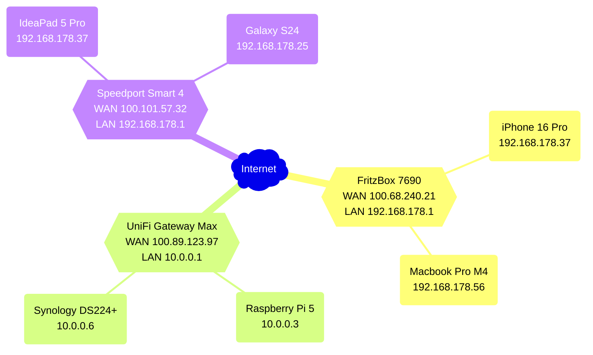
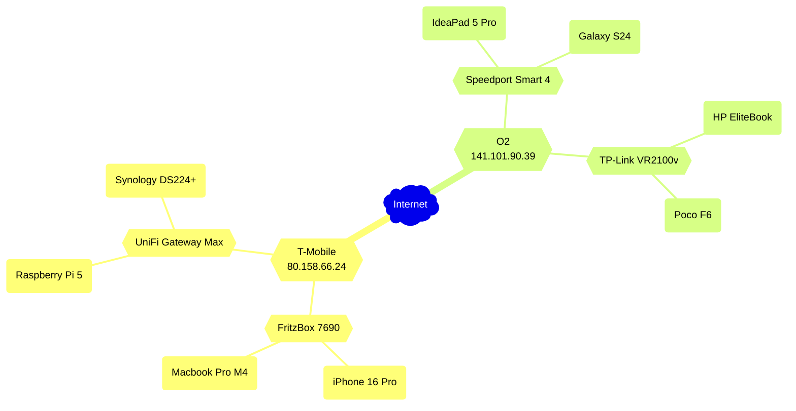
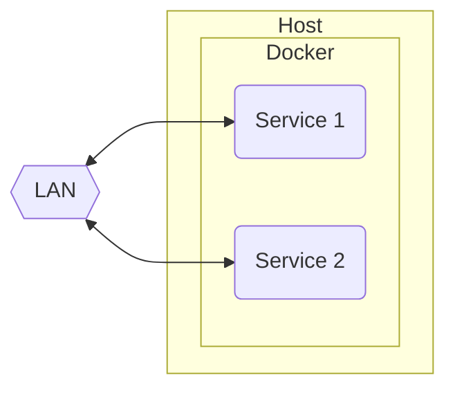
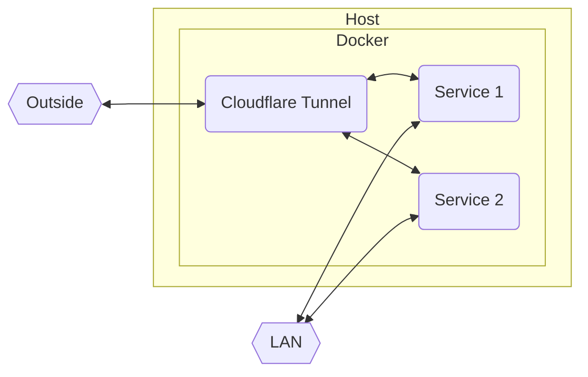
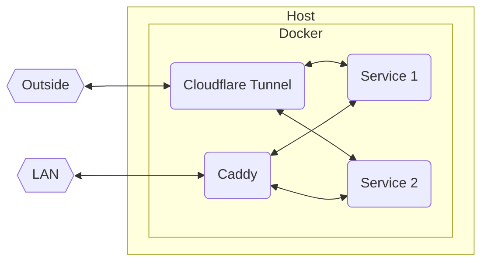

+++
title = "Cloudflare Tunnel: Accessing your Homelab from Anywhere"
date = "2024-12-17"
description = "For DS-Lite and CGNAT connections, no Port-Forwarding required."
[taxonomies]
tags = ["software"]
[extra]
mermaid = true
cover.image = "images/orange-clouds.jpg"
+++

# Intro

Back in the good old days, pretty much everyone with an internet connection had their own IP address.
For the first few decades, during the internet's infancy, this worked quite well.
Discussions about running out of addresses where scarce, surely the ~4.3 billion (2<sup>32</sup>) possible IPv4 addresses will suffice for this trend called internet to die down again.

Well, the internet did in fact not die as a niche, and today there are more people constantly connected with their smartphone than we have IPv4 addresses.
But how does this work? IPv6 adoption is still slow, so there must be a way to do this with IPv4.
And there is, it's called subnetting.



For simplicity, we'll mostly disregard the handling for IPv6, as it's not applicable for our case.


## Dedicated Public IP

With this, only a single device in a local network (<abbr title="Local Area Network">LAN</abbr>) will receive an outbound (<abbr title="Wide Area Network">WAN</abbr>) address, this device is commonly called the gateway (and/or router).
Devices in the LAN are given IPs within a range specially reserved for local use.
Connections to the outside now must be done via the gateway.
Inbound connections are more tricky, as the public will only "see" the gateway.
So one has to use something called port-forwarding, telling the gateway to forward requests on specific ports to specific clients within the LAN.
Access from other outside clients is then done with the WAN-IP of said gateway.





Example network. The details aren't really relevant, but see how "iPhone 16 Pro" and "IdeaPad 5 Pro" have the same local IP.
The subnets are essentially isolated and the two devices know nothing about each other.

## DS-Lite and CGNAT

But even this has not been enough to free up the IPv4 address space, so <abbr title="Internet Service Provider">ISP</abbr>s have been doing something very crafty:
Apply this ordeal again. A connection of this type is then called a <abbr title="Dual Stack Lite">DS-Lite</abbr> or <abbr title="Carrier-Grade Network Address Translation">CGNAT</abbr> (the difference between them won't really matter for our case).
Now, the ISP network (our WAN) is essentially just another LAN network to the outside world, with our gateways as the clients.
So now, our gateways are essentially unreachable to the outside world.
We would need to setup a port-forward on the ISPs gateway, which we don't have access to.
And our ISP wouldn't be happy about that either...





Example CGNAT network. Details again aren't relevant, but see how there is no way to reach a router from another ISPs network.

# Getting Started

> Yeah, enough boomer history talk, how do we actually get our homelab to the outside then?<br>
> — <cite>someone reading this, probably</cite>

In this tutorial, we will focus on Cloudflare tunnels.
The tunnel establishes a connection between our local client and a server from Cloudflare.
Connections are then done to said server, getting tunneled to our homelab depending on the requested resource.
Cloudflare is a good fit because they can also work as a proxy, providing <abbr title="Distributed Denial of Service">DDOS</abbr> protection and global caching for fast access.



Because Cloudflare distinguishes requests via the HTTP Host header, such a tunnel will only work for web traffic.

If you need something more broad for general TCP/UDP, take a look at the [collection of tools here](https://github.com/anderspitman/awesome-tunneling).


Prerequisites for this tutorial:

- A Cloudflare account (you can sign up with a Google account as well)
- Docker (can also work with VMs/LXCs or bare metal, but this guide uses Docker)
- Your own domain, added to your Cloudflare dashboard

For the latter, you do not need to register the domain at Cloudflare.
See the [documentation](https://developers.cloudflare.com/fundamentals/setup/manage-domains/add-site/) on how to add external domains.
You don't need a paid plan, the free plan provides all the features we are going to use.

If you are still looking for (cheap) domains, a good price comparison for global registrars is [TLD-List](https://tld-list.com/).
They don't track every registrar in the world, so you may be able to get a better deal with lesser-known ones.
But keep in mind to not only look at registration costs, but running costs as well, a lot of registrars will massively ramp up prices after the first year.
For `.de`-Domains, my personal recommendation is [netcup](https://www.netcup.com/en/).
At each last Tuesday of a month (except when there's already a special deal going), you can register a `.de`-Domain for cheap, with the price not changing (or at least not a lot) for later renewals.
Netcup also provides [very cost-effective vservers](https://www.netcup.com/de/server/guenstige-vserver-angebote), perfect for other services or if you want to host your own tunnel.

# Local Access

Before diving into the tunnel, let's go over the structure of our example project.
We will have two [webservers](https://hub.docker.com/r/strm/helloworld-http/) running, playing the roles of our services.
Consider this Compose file:

```yml
services:
    service1:
        image: strm/helloworld-http
        container_name: service1
        ports:
            - 8080:80

    service2:
        image: strm/helloworld-http
        container_name: service2
        ports:
            - 8081:80
```

And its resulting topology:





We can access our services within the LAN by connecting to `http://host:8080` and `http://host:8081` respectively. This is the common modus operandi, only providing local access, no HTTPS (or only untrusted self-signed TLS), and with the need to memorize random ports.

[Later](#speeding-up-optional), we will see a better version on how to handle local connections, but this will suffice for now.

# Cloudflare Tunnel

I will assume you already have your domain integrated into your Cloudflare dashboard.
For the rest of this tutorial, I will use my domain `sysleave.de` as a placeholder, replace with your domain as needed.
The next step will be adding the tunnel under Zero Trust (right sidepanel):


You might need to go through the initial setup step first.
It will ask you to choose a plan and enter payment credentials.
Again, the free plan is all we need.
We won't use any features that have metered billing, but for the future, keep in mind that some options within Zero Trust may.

Then, within the "Networks" tab, create a tunnel:


Choose Cloudflared, then name the tunnel anything you like (you can change the name later).

Press the right gray box to copy the command including your token:


We will only be needing the token, so dump your clipboard contents to a temporary notepad.

Now we're ready to redeploy our Docker Compose, adding a `cloudflared` container together with the token we just copied:

```yml
services:
    service1:
        image: strm/helloworld-http
        container_name: service1
        ports:
            - 8080:80

    service2:
        image: strm/helloworld-http
        container_name: service2
        ports:
            - 8081:80

    cloudflared:
        image: cloudflare/cloudflared
        container_name: cloudflared
        command: tunnel run
        environment:
            - TUNNEL_TOKEN=eyJhIjoiYT...
```

After a `docker compose up -d`, you should see that our container has successfully connected to our tunnel, so we're ready to click Next.

Now, we add our tunnel entries.
With "Subdomain" and "Domain", you can customize the <abbr title="Fully Qualified Domain Name">FQDN</abbr> as well as a path (not used for most applications) where your service will be available. Such an entry may look like this:


This will create a tunnel for <https://one.sysleave.de> to the `service1` container, which serves its content via HTTP.
We can use the container name here, as Docker conveniently configures its built-in DNS for that.
When doing so, we are accessing via the internal port of the container, so `80` in our case.
Because this is the default for HTTP, we can omit it in this case, but keep that in mind for services serving on other ports.

Depending on your application, you also might need to use HTTPS as "Type" (or one of the other ones available), as well as change some parts under the additional settings.
If your applications only listens to specific HTTP Host headers, you can add those there.
For services with (self-signed) certificates, you might also want to enable "No TLS Verify".
This way, a connection is made regardless if the certificate of the service is issued by a <abbr title="Certificate Authority">CA</abbr>.

We can then add a second "Public Hostname" entry to our tunnel for the second service.
Repeat for each service you want to have tunneled.
Our topology looks like this:





We are now able to access our services from outside via the encrypted tunnel, using <https://one.sysleave.de> and <https://two.sysleave.de>.
The TLS edge certificates are provided by Cloudflare for free and are used automatically.
Convenient!

# Speeding Up (optional)

Of course, we can also use our tunnel instead of access via LAN, but that would introduce an unnecessary amount of overhead.
What if we want to keep our local connections fast, while also getting the benefits of custom domain names, properly-signed certificates and no arbitrary ports?

To do this, we will use [Caddy](https://caddyserver.com/) as a reverse proxy and <abbr title="Automatic Certificate Management Environment">ACME</abbr> DNS challenges.
You will also need a local DNS server which you are able to configure, such as a AdGuard Home or Pi-hole.
Such a DNS is recommended anyways and probably one of the first homelab projects, so I won't cover them in detail.
The Compose with Caddy looks something like this:

```yml
services:
    service1:
        image: strm/helloworld-http
        container_name: service1

    service2:
        image: strm/helloworld-http
        container_name: service2

    cloudflared:
        image: cloudflare/cloudflared
        container_name: cloudflared
        command: tunnel run
        environment:
            - TUNNEL_TOKEN=eyJhIjoiYT...

    caddy:
        image: iarekylew00t/caddy-cloudflare # pre-packaged with cloudflare plugin
        container_name: caddy
        volumes:
        - ./caddy/:/etc/caddy/
        ports:
            - 80:80
            - 443:443

```

Notice how we removed the exposed ports from our services.
We won't be needing those any more, everything is going through our reverse proxy.
Next to our `compose.yml`, we will also create a folder `caddy` with a file called `Caddyfile`, the contents being:

```
{
	acme_dns cloudflare t0k3n...
}

one.sysleave.de {
	reverse_proxy service1:80 # internal docker port
}

two.sysleave.de {
	reverse_proxy service2:80
}
```

To get your DNS API token, head to <https://dash.cloudflare.com/profile/api-tokens> and create a token for "Edit zone DNS".
You will only need to change the rightmost field in "Zone Resources" to your domain:


Then, copy your token and paste it into your Caddyfile.
To recap, this is our folder structure:

```
.
├─ compose.yml
└─ caddy/
   └─ Caddyfile
```

We are now ready to rebuild the Compose stack.
Finally, to redirect local traffic to our Caddy reverse proxy, we use the oldest trick in the book: DNS rewrites.
How to do this depends on your DNS, but I'll show the rewrite for AdGuard Home as an example, adapt for your own environment if necessary:


Of course, change the IP and domain to your setup.
For convenience, I used a wildcard domain here to redirect all subdomains to Caddy.
This is then our final network topology:





After flushing our DNS cache, an access within the LAN with our custom domain will be done via the reverse proxy.
Certificates are automatically assigned, managed and renewed by Caddy.
If you want to add a service to the reverse proxy later down the line, it's as simple as adding an analogous entry and executing a
```
docker compose exec -w /etc/caddy caddy caddy reload
```
in the compose directory! (I'd recommend putting this into an alias or small shell script)

# Conclusion

I hope you enjoyed our little dive into networking, tunneling, certificate management and reverse proxies.
In my opinion, the setup shown provides a good foundation for further projects and expansions.

There are some modifications one can do, such as using a reverse proxy behind the tunnel.
This can allow for even better horizontal scaling and redundancy, but is probably outside the scope of the vast majority of homelabs.

Better things to tackle first would probably include hiding secrets in environment variables, not having them reside plaintext in config files.
The Docker networks can also be adjusted very fine-grained, isolating services from each other and only making them able to communicate with their respective proxy.
On the DNS side, setting up DNSSEC is also a good idea.

Maybe we will explore all this in future blog posts, but this should suffice for now.
