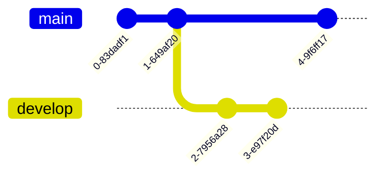

import YouTube from '../../components/YouTube.astro';
import DownloadButton from '../../components/DownloadButton.astro';
import Admonition from '../../components/Admonition.astro';
import { Image } from 'astro:assets';
import cardImage from '../../images/blog/test-post/card.png';

This article offers a sample of basic Markdown syntax, it also shows whether basic HTML elements are decorated with CSS in the theme.

{/* more */}

## Headings

The following HTML `<h1>`—`<h6>` elements represent six levels of section headings. `<h1>` is the highest section level while `<h6>` is the lowest.

# H1

## H2

### H3

#### H4

##### H5

###### H6

## Paragraph

Xerum, quo qui aut unt expliquam qui dolut labo. Aque venitatiusda cum, voluptionse latur sitiae dolessi aut parist aut dollo enim qui voluptate ma dolestendit peritin re plis aut quas inctum laceat est volestemque commosa as cus endigna tectur, offic to cor sequas etum rerum idem sintibus eiur? Quianimin porecus evelectur, cum que nis nust voloribus ratem aut omnimi, sitatur? Quiatem. Nam, omnis sum am facea corem alique molestrunt et eos evelece arcillit ut aut eos eos nus, sin conecerem erum fuga. Ri oditatquam, ad quibus unda veliamenimin cusam et facea ipsamus es exerum sitate dolores editium rerore eost, temped molorro ratiae volorro te reribus dolorer sperchicium faceata tiustia prat.

Itatur? Quiatae cullecum rem ent aut odis in re eossequodi nonsequ idebis ne sapicia is sinveli squiatum, core et que aut hariosam ex eat.

## Blockquotes

The blockquote element represents content that is quoted from another source, optionally with a citation which must be within a `footer` or `cite` element, and optionally with in-line changes such as annotations and abbreviations.

#### Blockquote without attribution

> Tiam, ad mint andaepu dandae nostion secatur sequo quae.
> **Note** that you can use _Markdown syntax_ within a blockquote.

#### Blockquote with attribution

> Don't communicate by sharing memory, share memory by communicating.<br />
> — <cite>Rob Pike[^1]</cite>

[^1]: The above quote is excerpted from Rob Pike's [talk](https://www.youtube.com/watch?v=PAAkCSZUG1c) during Gopherfest, November 18, 2015.

## Tables

Tables aren't part of the core Markdown spec, but we support them.

| Name  | Age |
| ----- | --- |
| Bob   | 27  |
| Alice | 23  |

#### Inline Markdown within tables

| Italics   | Bold     | Code   |
| --------- | -------- | ------ |
| _italics_ | **bold** | `code` |

## Code Blocks

```html
<!doctype html>
<html lang="en">
  <head>
    <meta charset="utf-8" />
    <title>Example HTML5 Document</title>
  </head>
  <body>
    <p>Test</p>
  </body>
</html>
```

## List Types

#### Ordered List

1. First item
2. Second item
3. Third item

#### Unordered List

- List item
- Another item
- And another item

#### Nested list

- Fruit
  - Apple
  - Orange
  - Banana
- Dairy
  - Milk
  - Cheese

## Images

<Image src={cardImage} alt="Card image" />


## Other Elements — abbr, sub, sup, kbd, mark

<abbr title="Graphics Interchange Format">GIF</abbr> is a bitmap image format.

H<sub>2</sub>O

X<sup>n</sup> + Y<sup>n</sup> = Z<sup>n</sup>

Press <kbd>Ctrl</kbd> + <kbd>Alt</kbd> + <kbd>Delete</kbd> to end a session.

Most <mark>salamanders</mark> are nocturnal, and hunt for insects, worms, and other small creatures.

## Mermaid Diagrams

### Flowchart


### Sequence Diagram


### Git Graph



## Admonitions

<Admonition type="note" title="Note">
  This is a note that can span multiple lines if needed.
</Admonition>

<Admonition type="abstract">
  This is an abstract or summary of the content.
</Admonition>

<Admonition type="info" title="Info">
  This is useful information for the reader.
</Admonition>

<Admonition type="tip">This is a tip to improve productivity.</Admonition>

<Admonition type="success">
  This indicates a successful operation or positive outcome.
</Admonition>

<Admonition type="question">
  This is a question that might be asked by readers.
</Admonition>

<Admonition type="warning">
  This warns about potential issues or things to be careful about.
</Admonition>

<Admonition type="failure">
  This indicates a failed operation or error condition.
</Admonition>

<Admonition type="danger">
  This highlights dangerous actions that could cause harm.
</Admonition>

<Admonition type="bug">This indicates a bug or unexpected behavior.</Admonition>

<Admonition type="example">
  This provides an example to illustrate a concept.
</Admonition>

<Admonition type="quote">
  This is a quoted block of text from another source.
</Admonition>

## YouTube Videos

Embed a YouTube video:

<YouTube videoId="_PPWWRV6gbA" title="Example YouTube Video" />

## Download Button

Download a file:

<DownloadButton fileName="favicon.ico" url="/favicon.ico" />
